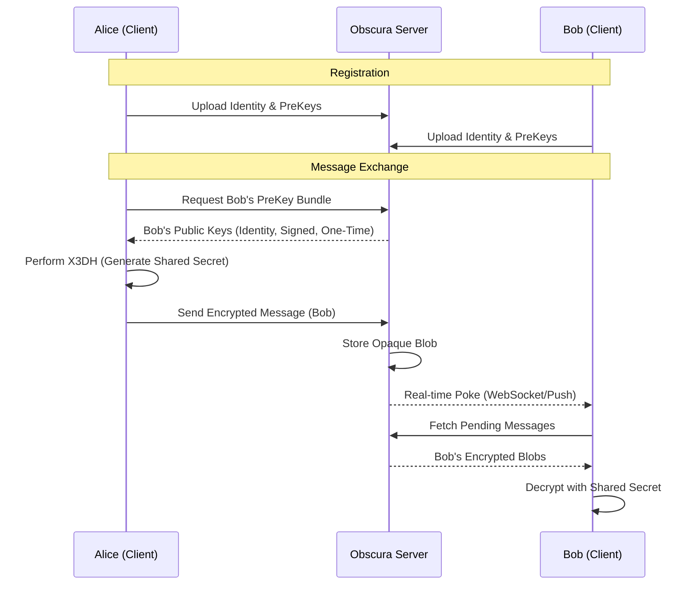

# Architecture

Obscura Server acts as a passive relay between Signal Protocol clients. It manages the discovery of cryptographic material and the queuing of encrypted blobs.

## Message Relay Flow

The following diagram illustrates how Alice sends an end-to-end encrypted message to Bob using the Obscura relay.

## System Components

- **API Layer**: Handles REST requests for account management, key uploads, and attachment handling.
- **Gateway Service**: Manages long-lived WebSocket connections for real-time delivery.
- **Background Workers**: 
    - **Cleanup**: Periodically prunes expired messages and attachments.
    - **Push Notifications**: Sends fallback notifications when clients are offline.
- **Storage Adapters**:
    - **PostgreSQL**: Stores persistent user metadata, keys, and message envelopes.
    - **Redis (Valkey)**: Powers the real-time notification bus and task queue.
    - **S3**: Stores encrypted attachments.
