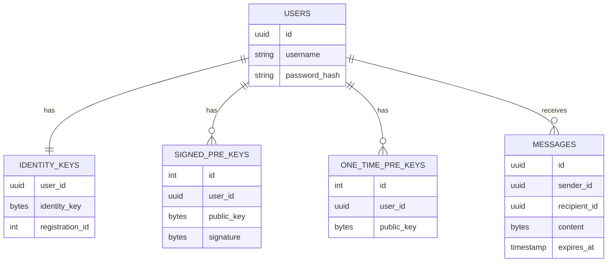

# Data Model: Signal Protocol Relay Server

**Database**: PostgreSQL

## 1. Users

Stores identity and authentication credentials.
*Note: This MVP enforces a Single-Device Model. A 'User' corresponds to exactly one 'Device'. API parameters named `deviceId` should be treated as synonymous with `user_id`.*

| Field | Type | Constraint | Description |
|-------|------|------------|-------------|
| `id` | `UUID` | PK, Default: `gen_random_uuid()` | Unique User ID |
| `username` | `VARCHAR(50)` | UNIQUE, NOT NULL | Public handle |
| `password_hash` | `VARCHAR(255)` | NOT NULL | Argon2 hash |
| `created_at` | `TIMESTAMPTZ` | DEFAULT: `now()` | Registration time |

## 2. PreKey Bundles

Stores the public keys for the Signal Protocol.
*Note: A user has one Identity Key, one Signed PreKey, and many One-Time PreKeys.*

### Table: `identity_keys`
| Field | Type | Constraint | Description |
|-------|------|------------|-------------|
| `user_id` | `UUID` | PK, FK -> `users.id` | The user |
| `identity_key` | `BYTEA` | NOT NULL | Public Identity Key |
| `registration_id` | `INTEGER` | NOT NULL | Signal Registration ID |

### Table: `signed_pre_keys`
| Field | Type | Constraint | Description |
|-------|------|------------|-------------|
| `id` | `INTEGER` | PK | Key ID (from client) |
| `user_id` | `UUID` | PK, FK -> `users.id` | The user |
| `public_key` | `BYTEA` | NOT NULL | The public key |
| `signature` | `BYTEA` | NOT NULL | Signature by Identity Key |
| `created_at` | `TIMESTAMPTZ` | DEFAULT: `now()` | |

### Table: `one_time_pre_keys`
| Field | Type | Constraint | Description |
|-------|------|------------|-------------|
| `id` | `INTEGER` | PK | Key ID (from client) |
| `user_id` | `UUID` | PK, FK -> `users.id` | The user |
| `public_key` | `BYTEA` | NOT NULL | The public key |

*Note: One-Time keys are deleted upon retrieval.*

## 3. Messages

Stores encrypted payloads for asynchronous delivery.

| Field | Type | Constraint | Description |
|-------|------|------------|-------------|
| `id` | `UUID` | PK, Default: `gen_random_uuid()` | Message ID |
| `sender_id` | `UUID` | FK -> `users.id` | Who sent it |
| `recipient_id` | `UUID` | FK -> `users.id`, INDEX | Who it is for |
| `content` | `BYTEA` | NOT NULL | Encrypted blob (SignalMessage) |
| `created_at` | `TIMESTAMPTZ` | DEFAULT: `now()` | |
| `expires_at` | `TIMESTAMPTZ` | NOT NULL | TTL enforcement |

## ER Diagram (Mermaid)

