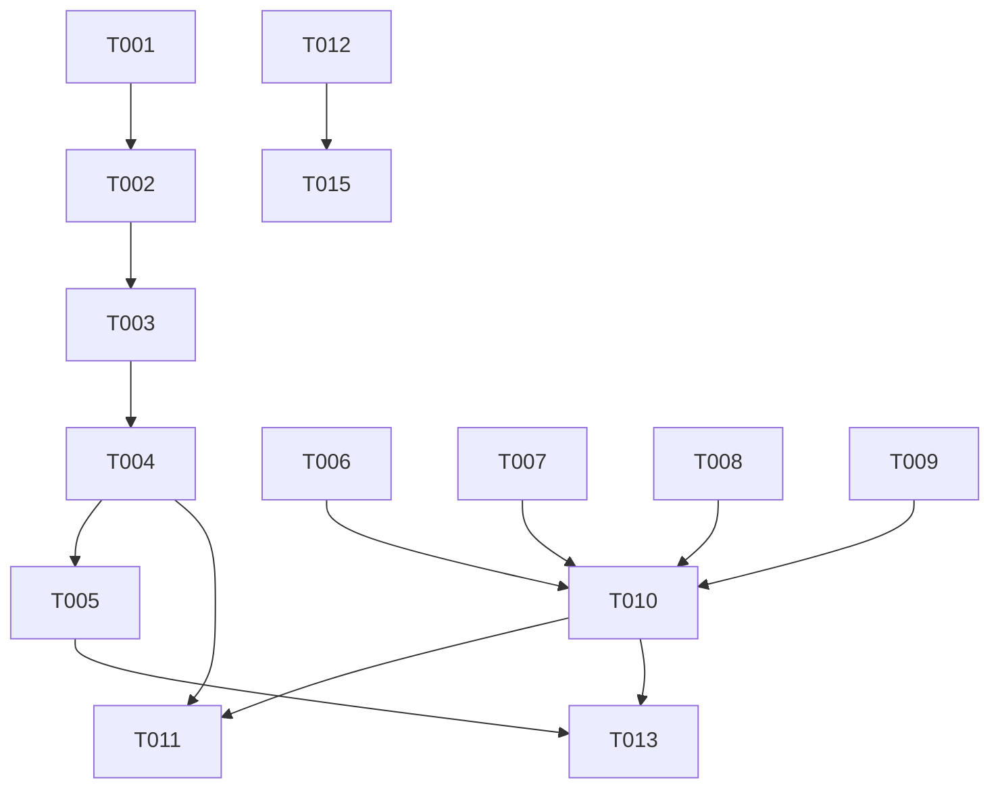

# Tasks: Device Takeover

**Branch**: `002-device-takeover`
**Spec**: [specs/002-device-takeover/spec.md](specs/002-device-takeover/spec.md)
**Plan**: [specs/002-device-takeover/plan.md](specs/002-device-takeover/plan.md)

## Implementation Strategy
We will implement this feature in two main passes:
1.  **Refactoring**: Upgrading the `Notifier` system to support typed events (`Disconnect`) and adding cleanup methods to repositories.
2.  **Takeover Logic**: Modifying the `upload_keys` endpoint to handle the "overwrite" logic and connecting the WebSocket gateway to the new "Disconnect" event.

## Phase 1: Setup
*Goal: Initialize branch and prepare test environment.*

- [x] T001 Create feature branch `002-device-takeover` (if not already current)
- [x] T002 [P] Create integration test file `tests/integration_takeover.rs` with empty test skeleton

## Phase 2: Foundational (Blocking)
*Goal: Enable the Notifier to send control signals and Repositories to perform bulk deletion.*

- [x] T003 [P] Update `src/core/notification.rs` to define `UserEvent` enum (MessageReceived, Disconnect)
- [x] T004 Update `InMemoryNotifier` in `src/core/notification.rs` to broadcast `UserEvent` instead of `()`
- [x] T005 Update `src/api/gateway.rs` to handle `UserEvent` (match `MessageReceived` -> fetch, `Disconnect` -> break loop)
- [x] T006 [P] Add `delete_all_for_user(user_id)` to `src/storage/message_repo.rs`
- [x] T007 [P] Add `delete_all_signed_pre_keys(user_id)` and `delete_all_one_time_pre_keys(user_id)` to `src/storage/key_repo.rs`

## Phase 3: User Story 1 - Device Takeover
*Goal: Allow authenticated users to overwrite their identity key, forcing a full session reset.*

**Independent Test**:
A client calls `POST /keys` with a *new* Identity Key. Result: Old Identity Key replaced, old pre-keys deleted, pending messages deleted, and any existing WebSocket connection for that user is terminated.

- [x] T008 [US1] Create unit tests for takeover logic in `src/storage/key_repo.rs` (mocking transaction flow if possible or relying on integration)
- [x] T009 [US1] Update `src/api/keys.rs` struct `PreKeyUpload` to include optional `identity_key` field
- [x] T010 [US1] Implement `upload_keys` logic in `src/api/keys.rs`: Detect identity key mismatch -> Transactionally delete old data (keys + messages) -> Insert new keys
- [x] T011 [US1] Update `src/api/keys.rs`: Trigger `notifier.notify(user_id, UserEvent::Disconnect)` upon successful takeover
- [x] T012 [US1] Update `src/api/gateway.rs`: Add check at connection start - Reject if user has no Identity Key
- [x] T013 [US1] Implement integration test in `tests/integration_takeover.rs`: Verify "Takeover" scenario (Data cleanup + WebSocket disconnect)
- [x] T014 [US1] Implement integration test in `tests/integration_takeover.rs`: Verify "Refill" scenario (Identity Key match -> No cleanup)
- [x] T015 [US1] Implement integration test in `tests/integration_takeover.rs`: Verify "No Key" connection rejection

## Phase 4: Polish & Cross-Cutting
*Goal: Final code cleanup and documentation.*

- [x] T016 Run `cargo fmt` and `cargo clippy` to ensure code quality standards
- [x] T017 Verify all tests pass with `cargo test`
- [x] T018 Update API documentation if generated (or manual verify against contracts/openapi.yaml)

## Dependencies

## Parallel Execution Examples

- **Repositories**: T006 (Message Repo) and T007 (Key Repo) can be implemented in parallel.
- **Notification**: T003 (Enum definition) is a blocker, but once defined, T005 (Gateway update) and T004 (Notifier update) can technically be coded in parallel (though T005 depends on T004's signature change to compile).
